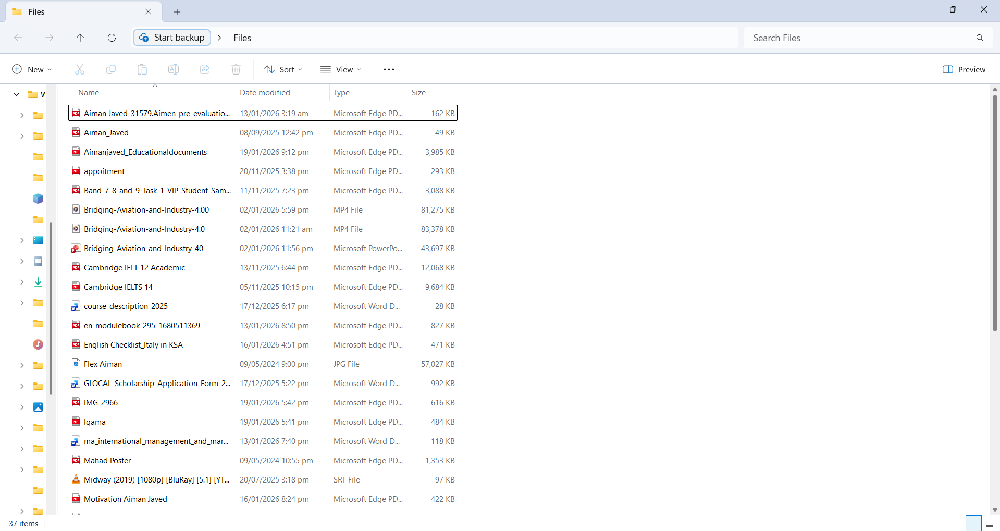
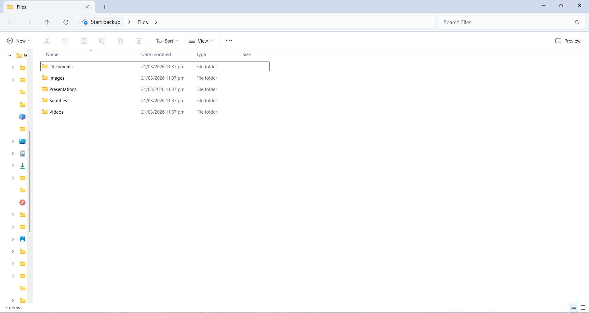

# 📂 Smart File Organizer (Python Automation)

### 💡 The Problem
Manually sorting, documents, and media files is time-consuming. I created this script to automate the organization of any messy directory, saving time and reducing digital clutter.

### 🛠️ What it Does
This Python script uses the `os` and `shutil` libraries to scan a specific folder and instantly move files into categorized sub-folders based on their file extensions.

### 📸 Proof of Concept

| Before (Messy Folder) | After (Organized Folder) |
| :---: | :---: |
|  |  |

### 🚀 Key Features
*   **Multi-Format Support**: Automatically detects and sorts:
    *   **Images**: .jpg, .png, .jpeg
    *   **Documents**: .pdf, .docx, .txt
    *   **Media**: .mp4, .mov (Videos) and .srt (Subtitles)
    *   **Presentations**: .ppt, .pptx
    *   **Others**: .exe, .zip, .rar
*   **Dynamic Folder Creation**: If a category folder (like "Subtitles") doesn't exist, the script creates it automatically.
*   **Safety First**: Designed to skip directories to avoid moving system folders.

### 📦 How to Use
1.  **Clone the repo**: `https://github.com/Aiman-Creates/Python-Automation-Toolkit`
2.  **Configure**: Open `file_organizer.py` and update the `directory` variable with your folder path.
3.  **Run**: Execute the script using `python file_organizer.py` in your terminal.

---
*Created as part of my Python Development Portfolio.*
